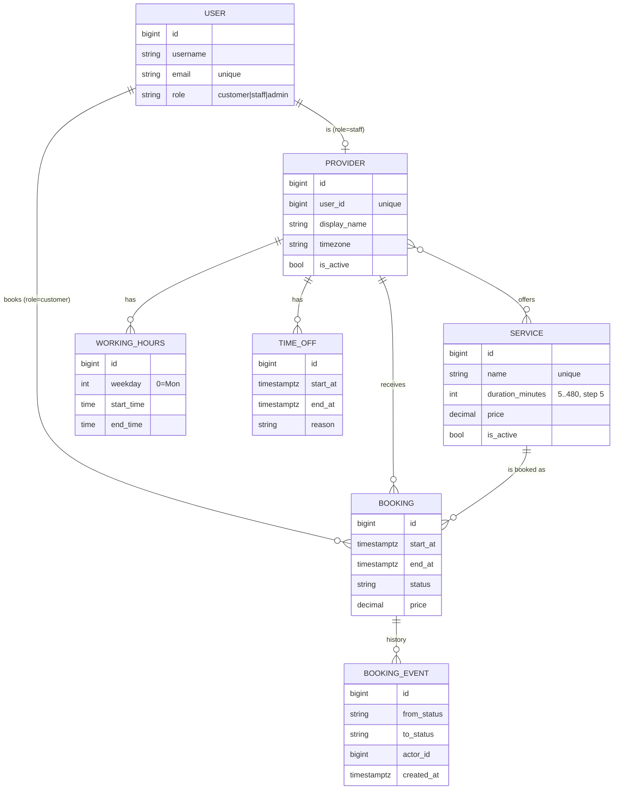
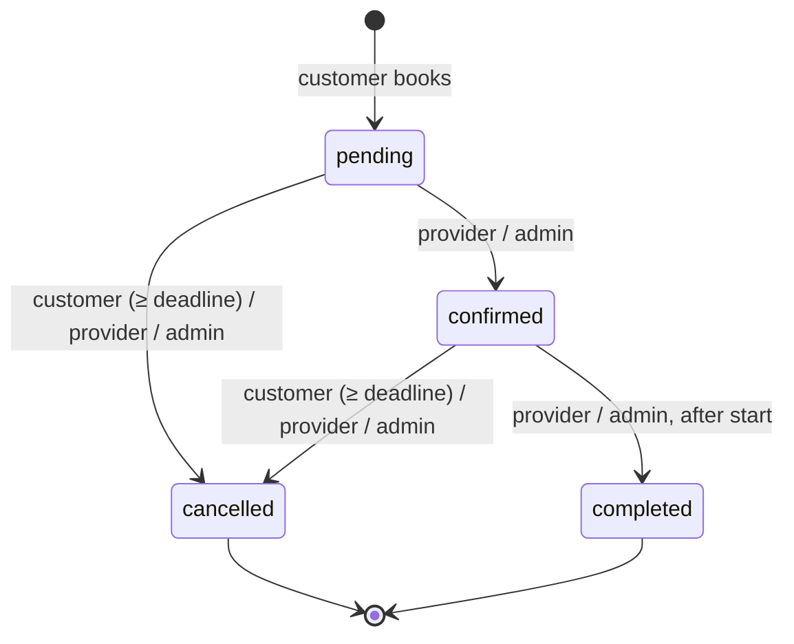

# Architecture

## Overview

A modular Django monolith split into four apps with one-directional dependencies:

```
accounts  ←  catalog  ←  scheduling  ←  bookings
(users)      (what/who)   (when)         (the booking itself)
```

Each app owns its models, API and tests. Business rules live in plain functions
(`scheduling/availability.py`, `bookings/services.py`), not in views or serializers:
views only parse input, call a service function and serialize the result. This keeps the
rules in one place, easy to test and reusable (e.g. from admin actions or a future Celery task).

## Database design



### Key decisions

| Decision | Why |
|---|---|
| **Django 5.2 LTS + Python 3.13** | Long-term support release (security fixes until April 2028) instead of the newest feature release — stability matters more than new features for a booking system. |
| **PostgreSQL**, not SQLite | Needed for `EXCLUDE USING gist` constraints on time ranges and for row-level locks. |
| **Custom `User` with `role`** from day one | Django cannot switch the user model cleanly later. Roles drive every permission check. |
| **`Booking.end_at` is stored** | If a service's duration changes later, existing bookings keep their real length. |
| **`Booking.price` is a snapshot** | Price changes must not rewrite history or revenue. |
| **Soft delete** for services and providers | They are referenced by past bookings (`on_delete=PROTECT`); deleting would break history. |
| **Working hours in local time, bookings in UTC** | "Every Monday 09:00–18:00" is a local-time rule and must survive DST changes. Concrete moments (bookings, time off) are stored as UTC `timestamptz`. Conversion uses `zoneinfo`. |
| **Half-open intervals `[start, end)`** everywhere | A booking ending at 11:00 and one starting at 11:00 do not overlap. Same rule in Python and in SQL (`tstzrange(start, end, '[)')`). |
| **No `choices` on `Provider.timezone`** | The tz list differs between OS/Python versions and produced spurious migrations. Validated in the serializer instead. |

## Preventing double booking

Four layers, from cheapest to strongest:

1. **Cheap validation** (no lock): service/provider active, provider offers the service, notice period, max advance.
2. **Row lock** — `SELECT … FOR UPDATE` on the provider row. All booking attempts for the same provider are
   serialized; bookings for different providers still run in parallel.
3. **Re-check inside the lock** — the requested start must be in the provider's current free-slot list
   (working hours − time off − active bookings, aligned to the slot step). If it overlaps an active booking → `409 Conflict`.
4. **Database constraint** — the final guarantee, independent of application code:

```sql
EXCLUDE USING gist (tstzrange(start_at, end_at, '[)') WITH &&, provider_id WITH =)
WHERE (status IN ('pending', 'confirmed'))
```

A second constraint of the same shape on `customer_id` stops one customer from being in two places at once.
Cancelled/completed bookings are excluded from the constraint, so cancelling frees the slot.

**Why a lock *and* a constraint?** The constraint alone is correct, but concurrent inserts against an
exclusion constraint can end in a `deadlock detected` error instead of a clean violation — this was observed
in the concurrency test for `TimeOff` (≈1 in 20 runs). The lock turns that into an orderly queue and a clean
`409`, while the constraint remains the safety net.

## Availability engine (`scheduling/availability.py`)

- `compute_slots(windows, busy, duration, step, earliest)` — a pure function with no DB access. Walks each
  working window in `step` increments and keeps candidates that fit inside the window, don't overlap any busy
  interval and start after `earliest` (now + minimum notice). Unit-tested without the database.
- `get_available_slots(provider, service, day)` — loads data from the DB and calls `compute_slots`.
- The booking service reuses the same function inside the lock, so "what the customer was shown" and
  "what the server accepts" can never disagree.

## Booking lifecycle



Allowed transitions live in one dictionary (`Booking.TRANSITIONS`). Every transition locks the booking row,
validates permissions and rules, updates the status and writes a `BookingEvent` (from, to, actor, note, time).

## Permissions

| Role | Can |
|---|---|
| anonymous | browse services, providers, working hours, availability; register |
| customer | book; see and cancel **own** bookings (before the deadline) |
| staff (provider) | manage **own** working hours and time off; see, confirm, cancel, complete bookings **assigned to them** |
| admin | everything |

Objects a user may not see return **404**, not 403, so IDs of other people's bookings are not leaked.

## Known limitations / next steps

- Working hours cannot cross midnight (a night shift must be split into two days).
- Availability is computed per provider per request; with many providers a cache (Redis) or a
  pre-computed slots table would be the next step.
- Email notifications and calendar (ICS) export are natural extensions: `BookingEvent` is the place to hook them in.
